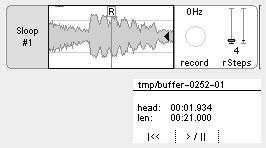

## Sloop! :boat:

A **clock synced looper** unit for the ER-301, built and tested on firmware **v0.5.01**.

I originally prototyped this unit through the UI but quickly discovered I couldn't handle the feature complexity without some serious abstraction. Thankfully the **Middle Layer SDK** allows for exactly that, so I present to you a feature rich native looping utility!

### Installation

To install, simply download this repo and copy the `Sloop` directory to your SD card under `ER-301/libs`.

The new unit will be available on the insert screen under **Recording and Loopers**.

### Patching Ideas

1. **4 Bar Looper** This is the default unit configuration. Connect an empty buffer, a **clock** that triggers once per bar, and a trigger to the **record** input. After **engaging** the unit, trigger the **record** input to write the incoming signal to the buffer for the next four bars. Once complete it will continue to play back the newly filled buffer. Trigger again to add overdubs!

2. **2 Step Recorder** As before connect an empty buffer and **clock** and **engage** the unit. Set the **steps** to 8 and the **rSteps** to 2. When the **record** input is triggered the incoming signal will be added to the buffer fo the next 2 steps only. Adjust the **rFdX** parameters to taste in order to avoid sudden level drops after the 2 steps are up.

3. **Random Sample** Using a relatively fast **clock**, set **steps** to 16 and **rSteps** to 1. Randomly trigger the **record** input to capture clock synced segments from the incoming signal. Adjust **rFdIn** and **rFdOut** to taste to avoid clicking induced from the sudden buffer writes.

### Parameter Overview

Parameter | Description
--------- | -----------
**clock** | The **clock** signal to sync the looper with.
**engage** | Activate to **engage** the looper. When toggled, playback will begin on the _next_ **clock** tick. Similarly, when disabled it will only stop on the _next_ **clock** tick. In addition, all internal counters will be paused while the unit is **disengaged**, so when re-engaged it will continue playing from where it left off.
**reset** | **reset** the internal counter on the next **clock** tick, sending the play/record head back to the beginning of the buffer.
**record** | Start **recording** on the next **clock** tick and continue for **rSteps**.
**through** | The input through level. Set to 0 to mute the incoming signal from appearing at the output.
**steps** | The number of **steps** to take while playing before automatically resetting the play head to the beginning of the buffer.
**rSteps** | The number of steps to **record** for after triggered.
**rFdbk** | Optionally reduces the buffer level when recording over it. With a value of 1, newly recorded data will be layered on top of the existing buffer data. With a value of 0, the data in the buffer will be completely overwritten when the record head passes over it.
**rFdIn** | After triggering a record, **rFdIn** determines how long it will take for the record level to reach it's maximum. This can be used to avoid clicks when recording audio already in motion.
**rFdOut** | After a **record** finishes, **rFdOut** determines how long it will take for the recording level to drop to zero. This can be used to add natural tails to the recording so there isn't a sudden drop at the end of the loop.

### Configuration
## Buffer
Header | Option | Description
-------|--------|------------
Buffer | | 
" | **New...** | Create and attach a new buffer with a specfied length.
" | **Pool...** | Attach an existing buffer from the pool.
" | **Card...** | Load a sample from the SD card and attach it.
" | **Edit...** | Edit the attached buffer, with options to trim, normalize, etc.
" | **Detach!** | Detach the active buffer.
" | **Zero!** | Zero the attached buffer. Provides a quick way to clear the active loop.
Record Length | | 
"  | **Fixed** | Enable to lock the record length to the loop length.
Force Reset On... | | 
"  | **Disengage** | Reset the looper when **engage** is toggled off. Useful for keeping the looper in sync with drum machines when the clock is tied to a run signal.
"  | **Record** | Reset the looper when **record** is triggered. Useful for keeping loop buffers aligned correctly.

